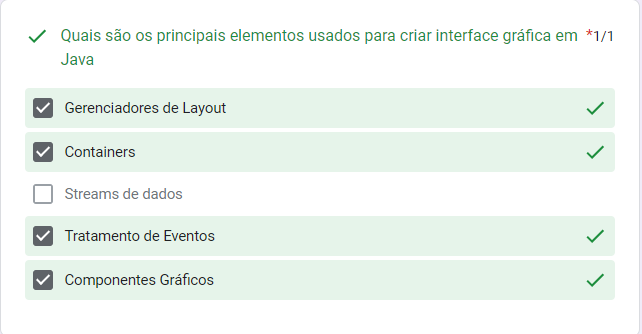
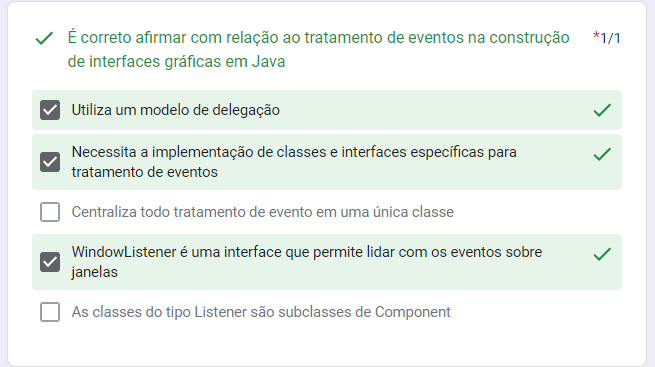
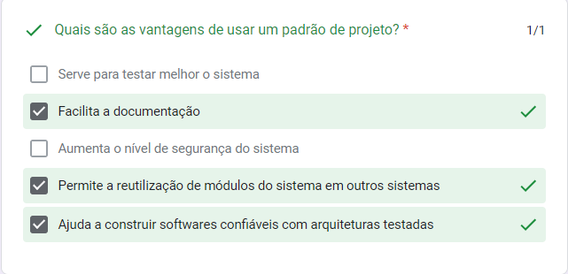
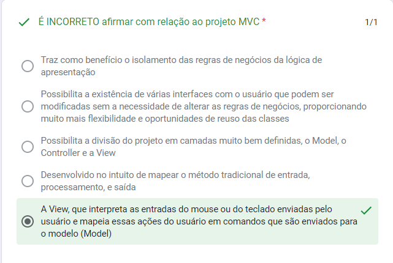
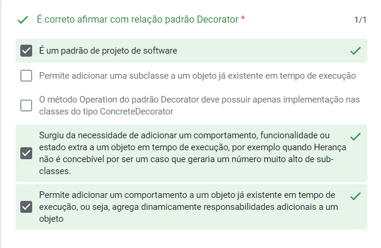
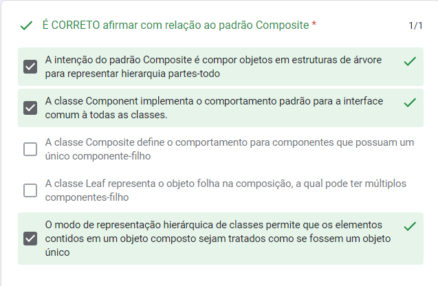
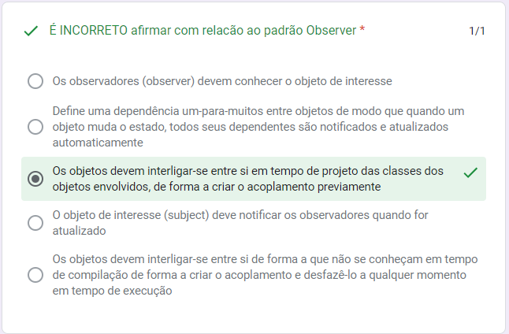
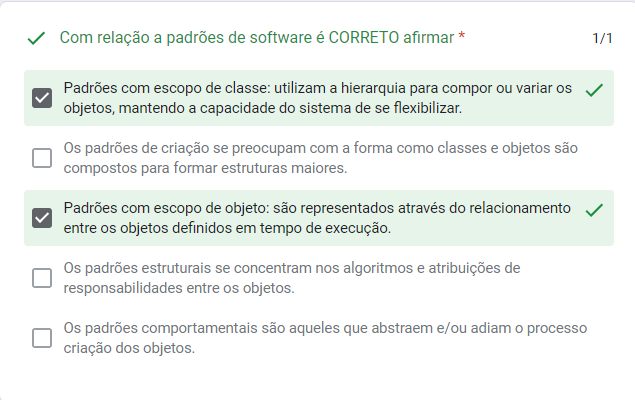
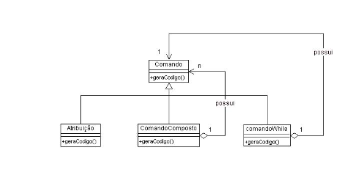
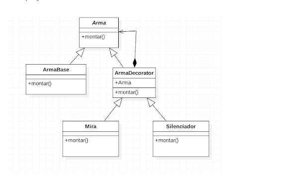

# Simulado P2 - TecProg 

## **1º**
---

### **item errado:**
 **Streams de dados** não são os principais elementos usados para criar interface gráfica em Java. As streams de dados são usadas principalmente para a entrada e saída de dados, como leitura e escrita em arquivos ou conexões de rede.

## **2º**
---

### **itens errado:**
**Centraliza todo tratamento de evento em uma única classe:** O tratamento de eventos em Java não é centralizado em uma única classe. Pelo contrário, cada componente pode ter seu próprio tratador de eventos, permitindo que diferentes ações sejam executadas para eventos específicos de cada componente.

**As classes do tipo Listener são subclasses de Component:** As classes do tipo Listener não são subclasses de Component. Na verdade, as classes do tipo Listener são interfaces que definem os métodos de tratamento de eventos, e as classes que implementam essas interfaces são responsáveis por fornecer a implementação desses métodos.
## **3º**
---

### **itens errado:**
**Serve para testar melhor o sistema:** Embora a aplicação de padrões de projeto possa contribuir indiretamente para melhorar a testabilidade de um sistema, esse não é o objetivo principal dos padrões. Os padrões de projeto visam fornecer soluções comuns para problemas de design e estruturação do código.

**Aumenta o nível de segurança do sistema:** Os padrões de projeto não estão diretamente relacionados ao aumento do nível de segurança do sistema. A segurança é uma preocupação que deve ser tratada por meio de outras práticas e técnicas específicas.
## 4º
---

### **Porque é incorreto:**
**Desenvolvido no intuito de mapear o método tradicional de entrada, processamento, e saída:** O projeto MVC (Model-View-Controller) não foi desenvolvido com o intuito específico de mapear o método tradicional de entrada, processamento e saída. O MVC é um padrão de projeto de arquitetura de software que busca separar as responsabilidades do sistema em três componentes principais: o Model, a View e o Controller.
## 5º
---

### **itens errado:**
**O método Operation do padrão Decorator deve possuir apenas implementação nas classes do tipo ConcreteDecorator:** Essa afirmação está incorreta. O método "Operation" no padrão Decorator deve ser implementado tanto na classe base quanto nas classes concretas de decoradores. O objetivo é que o método seja chamado em cascata, passando pelos diferentes níveis de decoradores e chegando ao objeto base.
> Gepeto disse que essa a seguir está correta. se souberem dizer por que é incorreta eu aceito.

**Permite adicionar uma subclasse a um objeto já existente em tempo de execução:** O padrão Decorator permite adicionar funcionalidades extras a um objeto existente em tempo de execução, envolvendo-o com um ou mais decoradores. Isso é feito sem modificar a estrutura das classes existentes.

## 6º
---

### **itens errado:**
**A classe Composite define o comportamento para componentes que possuam um único componente-filho:** Essa afirmação está incorreta. A classe Composite define o comportamento para componentes compostos, ou seja, aqueles que podem ter vários componentes-filho. A classe Composite é responsável por gerenciar e realizar operações em seus componentes-filho.

**A classe Leaf representa o objeto folha na composição, a qual pode ter múltiplos componentes-filho:** Essa afirmação também está incorreta. A classe Leaf representa um objeto folha na estrutura do Composite e não possui componentes-filho. Ela é responsável por implementar o comportamento específico do objeto folha.

## 7º
---

### **Porque é incorreto:**
**Os objetos devem interligar-se entre si em tempo de projeto das classes dos objetos envolvidos, de forma a criar o acoplamento previamente:** Essa afirmação está incorreta. No padrão Observer, os objetos não precisam se interligar em tempo de projeto das classes para criar o acoplamento. Pelo contrário, o padrão Observer busca desacoplar o objeto de interesse (subject) dos observadores (observers), permitindo que eles sejam adicionados e removidos dinamicamente durante a execução do programa.
## 8º
---

### **Porque é a correta:**
A serialização de objetos em Java é um mecanismo que permite converter um objeto em uma sequência de bytes. O principal objetivo da serialização é armazenar ou transmitir o estado de um objeto, de modo que ele possa ser recriado posteriormente. Ao serializar um objeto, apenas o estado dos seus atributos é armazenado, não incluindo o comportamento do objeto.

A serialização de objetos permite que o objeto seja armazenado em um arquivo, transmitido pela rede ou mantido em uma base de dados, possibilitando a persistência dos dados do objeto. Posteriormente, é possível desserializar o objeto, ou seja, recriá-lo a partir da sequência de bytes, obtendo assim o estado original do objeto.
## 9º
---

### **itens errado:**
Os **padrões de criação** se preocupam com a criação de objetos e classes, não com a forma como eles são compostos para formar estruturas maiores

Os **padrões estruturais** se concentram em como os objetos e classes são compostos para formar estruturas maiores, não em algoritmos e atribuições de responsabilidades entre os objetos

Os **padrões comportamentais** não têm relação com o processo de criação de objetos, mas sim com a comunicação e interação entre eles
## 10º e 11º
---
As duas questões apresentam diagramas e perguntam qual o padrão de projeto associado a eles.

***Composite:***

***Decorator:***
